# Css and Javascript projects

## 1. 3D Menu       
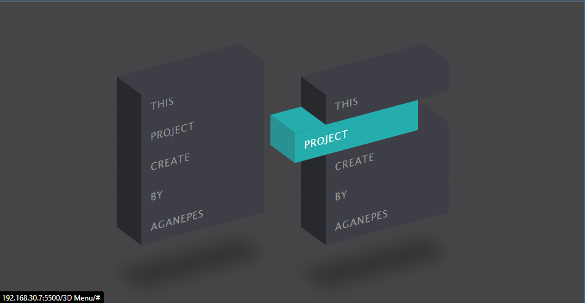
## Backgrount Slider     

## Card Swap Transition Effects
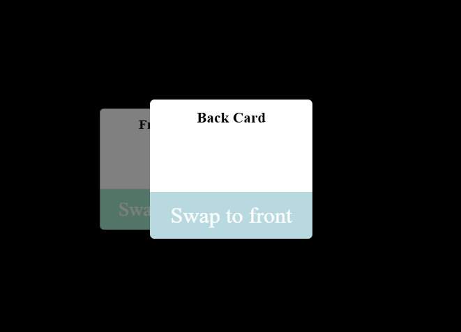
## Digetal Clock             
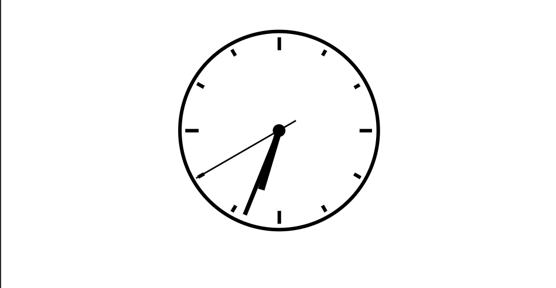
## Scrool animation
## Analog clock  
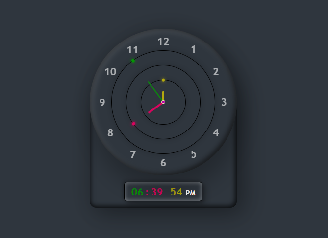
## Button Hover          
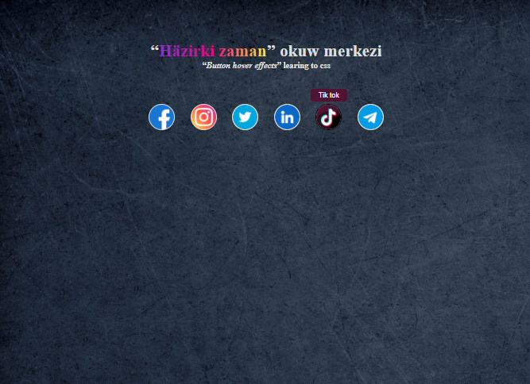
## Cart Drawer UI                
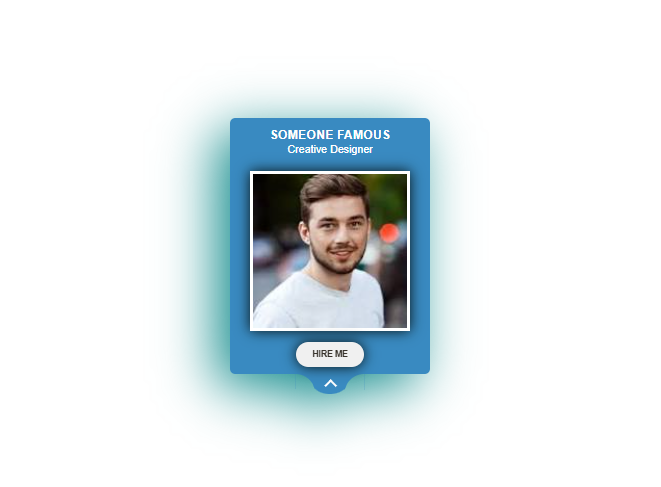
## Note app(drag and drop)  
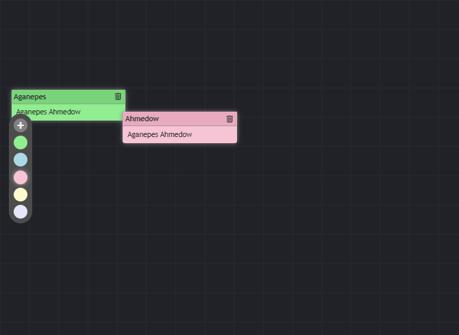
## Quiz App  
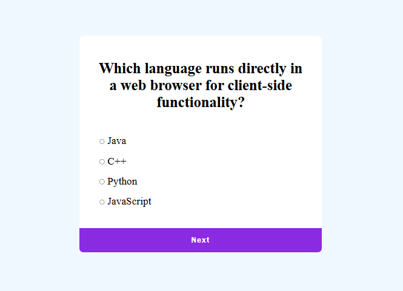
## Video Background

## Api Pexels    

## Button Ripple Effect
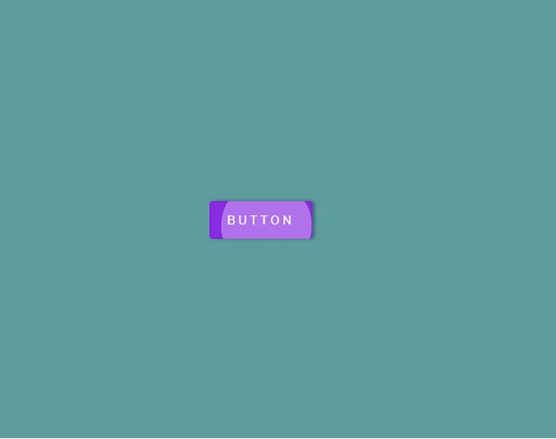
## Dark mode
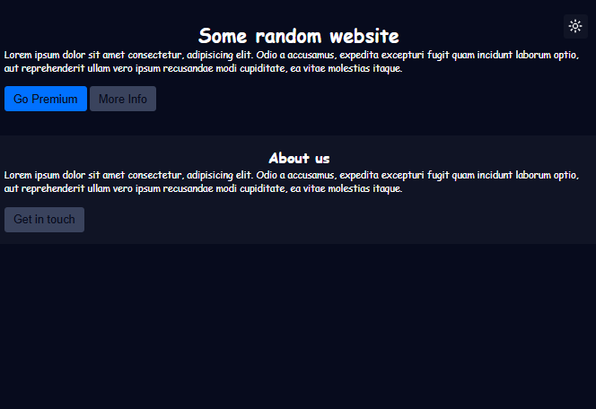
## Perzi Chess
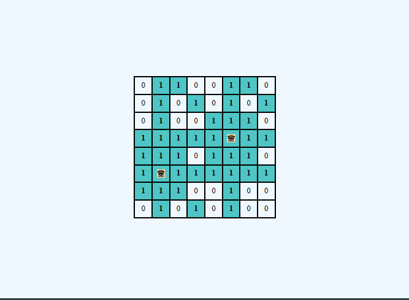
## Web component  with temaplate

## CSS Mask Reveal Animation
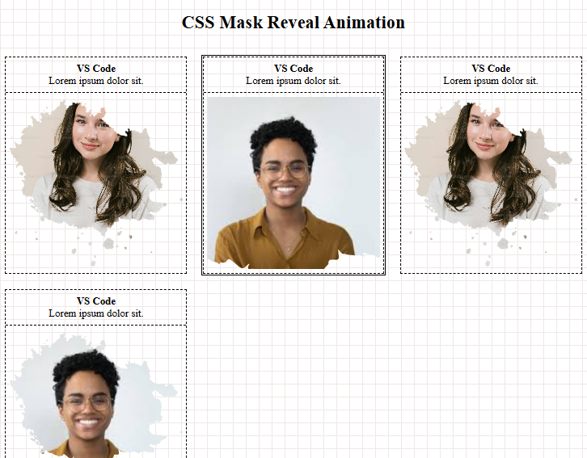

## Music Player

